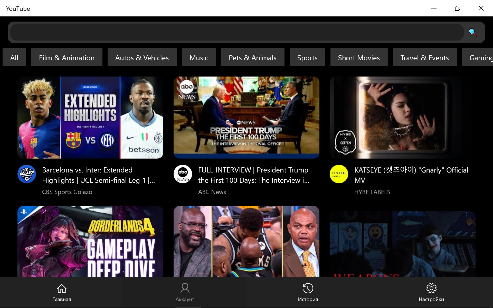
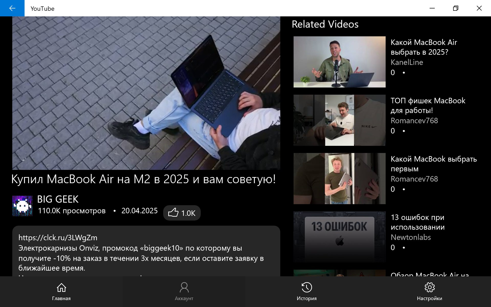
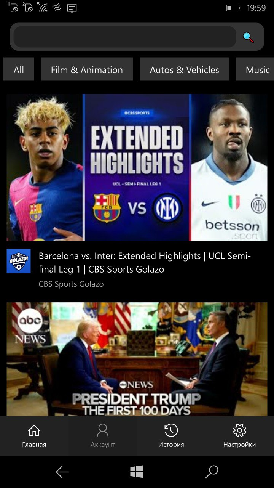
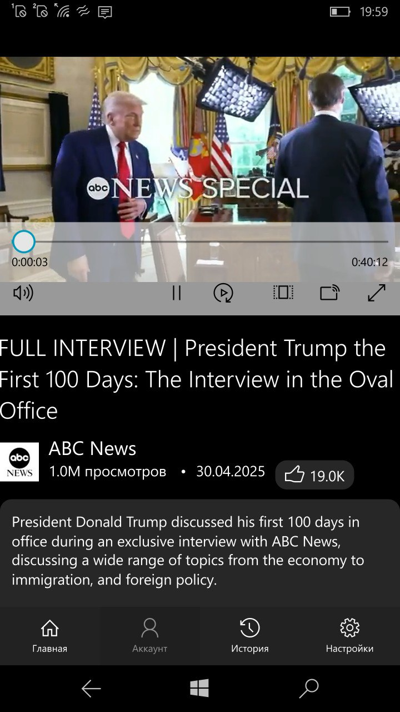

<h1>YouTube API Legacy</h1>

<a href="https://discord.gg/KUTcABsCrX">Discord</a>

We are looking for people who could help with the development of the project.

Instances:
- <a href="https://legacyprojects.ru/youtube/">LegacyProjects</a>
- <a href="https://qqq.bccst.ru/youtube/">qqq.bccst.ru</a>

### Implemented:
- categories
- videos from categories
- recommendations
- video search
- getting video data
- getting a direct link to the video
- Video from a certain person
- Getting information about the author of the video
- Comments
- Search suggestions

## Installation
Installation involves downloading files from the repository to the host and configuring in config.php .
## Setting up config.php
- be sure to replace the url value with your api path.
- optionally enter the general youtube_api_key
- configure the proxy as desired (line 48)
- optionally enter invidious_url and oldyoutube_url

# The code will be updated
It is planned to log in to the account and receive personal recommendations, as well as subscriptions.

Screenshots of the client using this API:

 

## The code is written and designed by Zemonkamin
