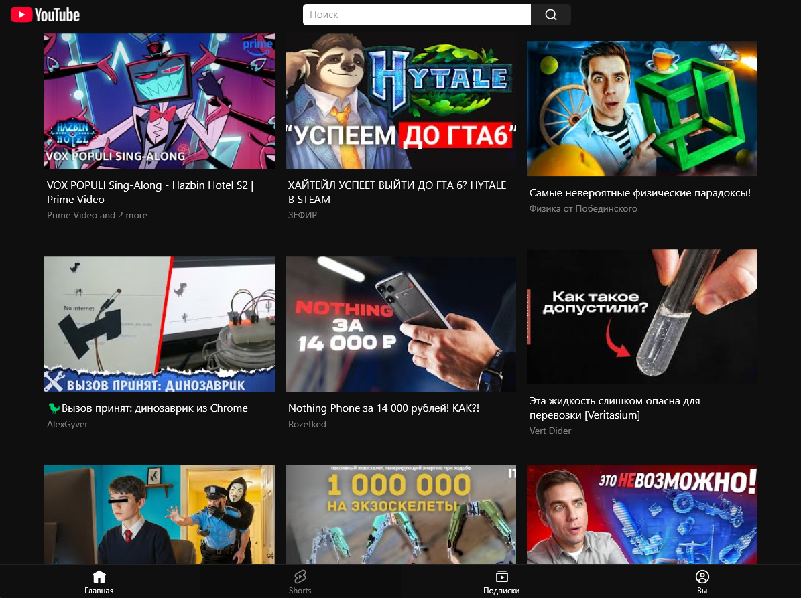
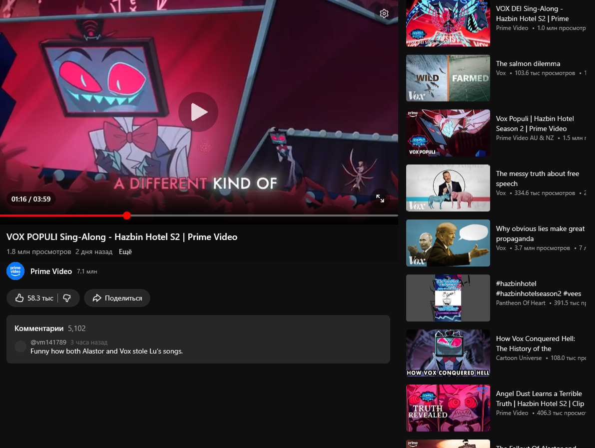
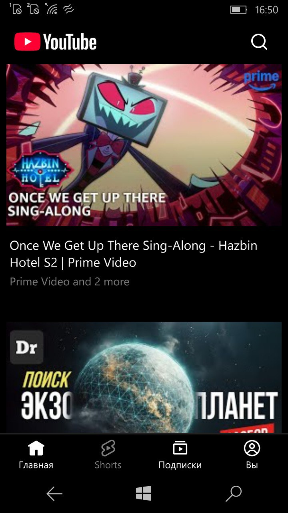
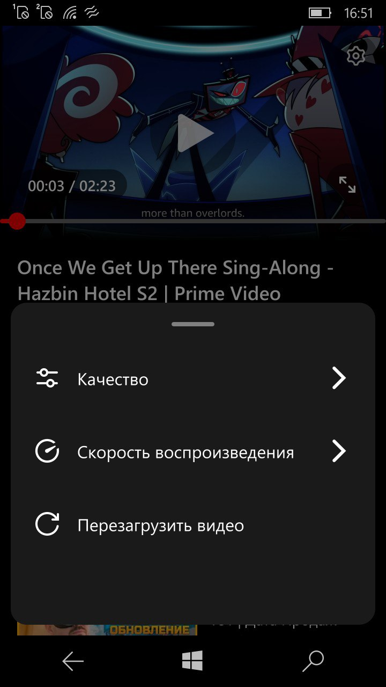

<h1>YouTube API Legacy</h1>

<a href="https://discord.gg/KUTcABsCrX">Discord</a>

We are looking for people who could help with the development of the project.

Instances:
- <a href="https://legacyprojects.ru/youtube/">LegacyProjects</a>
- <a href="https://qqq.bccst.ru/youtube/">qqq.bccst.ru (old php version)</a>

Install:
pip install flask flask-cors yt-dlp google-auth google-auth-oauthlib google-api-python-client requests pillow qrcode flask_session

### Implemented:
- categories
- videos from categories
- recommendations
- video search
- getting video data
- getting a direct link to the video (in various quality)
- Video from a certain person
- Getting information about the author of the video
- Comments
- Search suggestions
- authorization
- personal recommendations

Screenshots of the client using this API:

 

